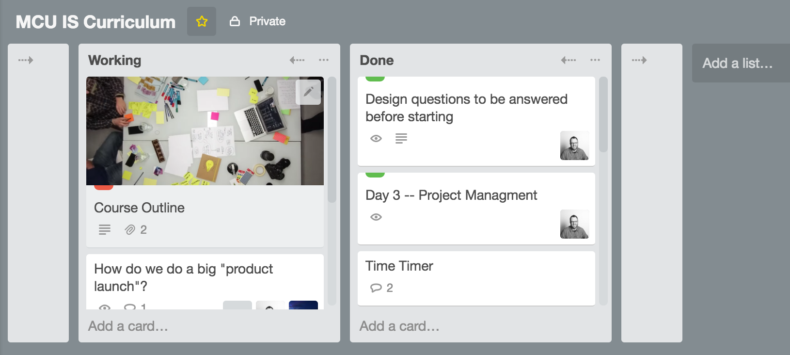

# Collar

#### Collar for Trello adds a button that hides Trello columns

It ends up looking kind of like this:

Thanks to [trelabels](https://github.com/fredericseiler/trelabels), from which I stole liberally.

Additional thanks to [Huboard](https://github.com/huboard/huboard-web), from which I stole the feature entirely.
